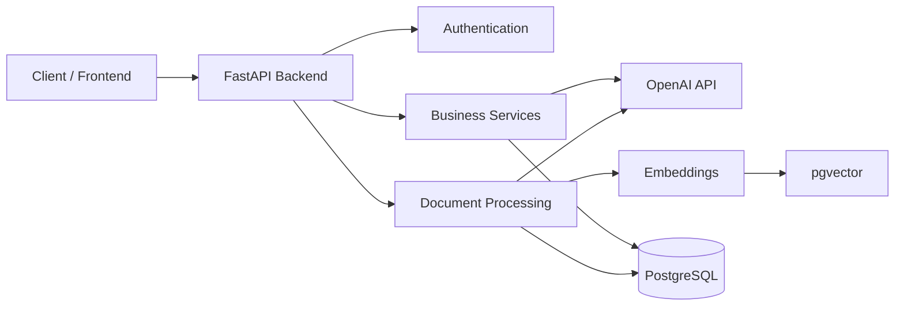

**Leer en otros idiomas:** [English](README.md)

# 🤖 SmartVanguard — Plataforma de inteligencia empresarial con IA

> 🚧 **Proyecto en desarrollo**

SmartVanguard es una plataforma backend impulsada por Inteligencia Artificial cuyo objetivo es ayudar a las empresas a transformar datos en información útil mediante IA, procesamiento de documentos y Retrieval-Augmented Generation (RAG).

---

# 💼 Sobre este proyecto

SmartVanguard representa mi principal proyecto personal y refleja mi transición desde el desarrollo Backend tradicional hacia Data & AI Engineering.

El objetivo es construir una plataforma capaz de comprender información empresarial, analizar documentos, procesar conjuntos de datos y asistir la toma de decisiones utilizando modelos de Inteligencia Artificial.

Más que un chatbot, busca convertirse en una plataforma modular para automatización y análisis empresarial.

---

# 📌 Descripción

La aplicación se desarrolla utilizando una arquitectura modular basada en FastAPI y PostgreSQL.

Actualmente el enfoque está puesto en construir un backend escalable mientras se incorporan gradualmente funcionalidades de IA como embeddings, búsqueda semántica, procesamiento documental y análisis empresarial.

---

# 💡 Visión

Muchas empresas poseen información distribuida entre hojas de cálculo, PDFs y bases de datos, pero no cuentan con herramientas que permitan convertir esos datos en conocimiento.

SmartVanguard busca resolver ese problema permitiendo:

- Comprender documentación empresarial
- Responder preguntas utilizando IA
- Analizar archivos CSV
- Generar insights de negocio
- Asistir la toma de decisiones
- Automatizar tareas repetitivas de análisis

---

# ⚙️ Funcionalidades actuales

✔ Autenticación JWT

✔ Gestión de usuarios

✔ Gestión de empresas

✔ PostgreSQL

✔ SQLAlchemy

✔ API REST con FastAPI

✔ Integración con OpenAI

✔ Generación de Embeddings

✔ Base vectorial (pgvector)

✔ Carga de documentos

✔ Arquitectura modular

---

# 🚀 Funcionalidades planificadas

- Retrieval-Augmented Generation (RAG)
- Búsqueda semántica
- Análisis de CSV
- Dashboard empresarial
- Agentes de IA
- Indicadores de negocio
- Reportes financieros
- Multiempresa
- Roles y permisos
- Docker

---

# 🏗️ Arquitectura



---

# 🧰 Tecnologías

- Python
- FastAPI
- PostgreSQL
- SQLAlchemy
- OpenAI API
- pgvector
- Pandas
- JWT
- Pydantic
- Alembic

---

# 📂 Estructura del proyecto

```text
app/
│
├── api/
├── core/
├── database/
├── models/
├── routers/
├── schemas/
├── services/
├── utils/
│
main.py
```

---

# 📚 Objetivos de aprendizaje

Este proyecto funciona como mi principal laboratorio para aprender tecnologías modernas de Backend e Inteligencia Artificial.

Actualmente estoy profundizando en:

- Arquitectura Backend
- APIs REST
- FastAPI
- PostgreSQL
- SQLAlchemy
- Bases de datos vectoriales
- Embeddings
- Retrieval-Augmented Generation
- Prompt Engineering
- Agentes de IA
- Business Intelligence

---

# 🛣️ Roadmap

- ✅ Arquitectura Backend
- ✅ Diseño de Base de Datos
- ✅ Autenticación
- ✅ CRUD
- ✅ Integración con OpenAI
- ✅ Embeddings
- 🔄 Procesamiento de documentos
- 🔄 RAG
- ⏳ Agentes de IA
- ⏳ Dashboard empresarial
- ⏳ Despliegue en producción

---

# 🚀 Instalación

## Clonar el repositorio

```bash
git clone https://github.com/StefiVergini/SmartVanguard.git

cd SmartVanguard
```

## Instalar dependencias

```bash
pip install -r requirements.txt
```

## Configurar variables de entorno

Crear un archivo `.env`.

Ejemplo:

```env
OPENAI_API_KEY=tu_api_key

DATABASE_URL=postgresql://...
```

## Ejecutar

```bash
uvicorn main:app --reload
```

---

# 👩‍💻 Autora

**Stefanía Vergini**

Backend Developer • Data & AI Engineering

GitHub

https://github.com/StefiVergini