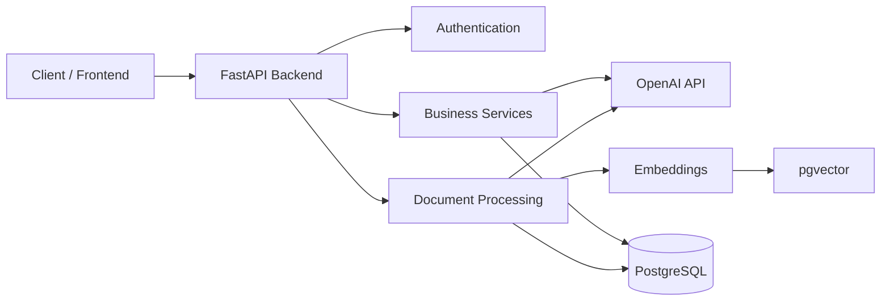

**Read this in other languages:** [Español](README.es.md)

# 🤖 SmartVanguard — AI Business Intelligence Platform

> 🚧 **Work in Progress**
>
> An AI-powered backend platform designed to help businesses transform data into actionable insights through Artificial Intelligence, document processing and Retrieval-Augmented Generation (RAG).

---

# 💼 About This Project

SmartVanguard is my main personal project and represents my transition from traditional Backend Development into Data & AI Engineering.

The goal is to build an intelligent platform capable of understanding business information, processing documents, analyzing datasets and assisting decision-making through Large Language Models (LLMs).

Rather than being a simple chatbot, the project aims to become a modular AI platform for business automation and analysis.

---

# 📌 Overview

The platform is being developed following a modular architecture based on FastAPI and PostgreSQL.

Current development focuses on building a scalable backend while gradually integrating AI capabilities such as embeddings, semantic search, document retrieval and business analytics.

---

# 💡 Vision

Many companies own valuable information spread across spreadsheets, PDFs and databases but struggle to transform that data into useful knowledge.

SmartVanguard aims to solve this problem by providing an intelligent assistant capable of:

- Understanding company documentation
- Answering questions using AI
- Analyzing CSV datasets
- Generating business insights
- Assisting decision-making
- Automating repetitive analysis tasks

---

# ⚙️ Current Features

✔ JWT Authentication

✔ User Management

✔ Company Management

✔ PostgreSQL Integration

✔ SQLAlchemy ORM

✔ FastAPI REST API

✔ OpenAI API Integration

✔ Embeddings Generation

✔ Vector Database (pgvector)

✔ Document Upload

✔ Modular Architecture

---

# 🚀 Planned Features

- Retrieval-Augmented Generation (RAG)
- Multi-document search
- CSV analytics
- Dashboard
- AI Agents
- Business KPIs
- Financial reports
- Multi-company support
- Role-based permissions
- Docker deployment

---

# 🏗️ Architecture



---

# 🧰 Technologies

- Python
- FastAPI
- PostgreSQL
- SQLAlchemy
- OpenAI API
- pgvector
- Pandas
- JWT Authentication
- Pydantic
- Alembic

---

# 📂 Project Structure

```text
app/
│
├── api/
├── core/
├── database/
├── models/
├── routers/
├── schemas/
├── services/
├── utils/
│
main.py
```

---

# 📚 What I'm Learning

This project serves as my primary learning platform for modern backend and AI technologies.

Topics currently being explored include:

- Backend Architecture
- REST APIs
- FastAPI
- PostgreSQL
- SQLAlchemy
- Vector Databases
- Embeddings
- Retrieval-Augmented Generation (RAG)
- Prompt Engineering
- AI Agents
- Business Intelligence

---

# 🛣️ Development Roadmap

- ✅ Backend Architecture
- ✅ Database Design
- ✅ Authentication
- ✅ CRUD APIs
- ✅ OpenAI Integration
- ✅ Embeddings
- 🔄 Document Processing
- 🔄 Retrieval-Augmented Generation (RAG)
- ⏳ AI Agents
- ⏳ Business Analytics Dashboard
- ⏳ Production Deployment

---

# 🚀 Installation

## Clone repository

```bash
git clone https://github.com/StefiVergini/SmartVanguard.git

cd SmartVanguard
```

## Install dependencies

```bash
pip install -r requirements.txt
```

## Configure environment variables

Create a `.env` file with your credentials.

Example:

```env
OPENAI_API_KEY=your_key

DATABASE_URL=postgresql://...
```

## Run

```bash
uvicorn main:app --reload
```

---

# 👩‍💻 Author

**Stefanía Vergini**

Backend Developer • Data & AI Engineering

GitHub

https://github.com/StefiVergini